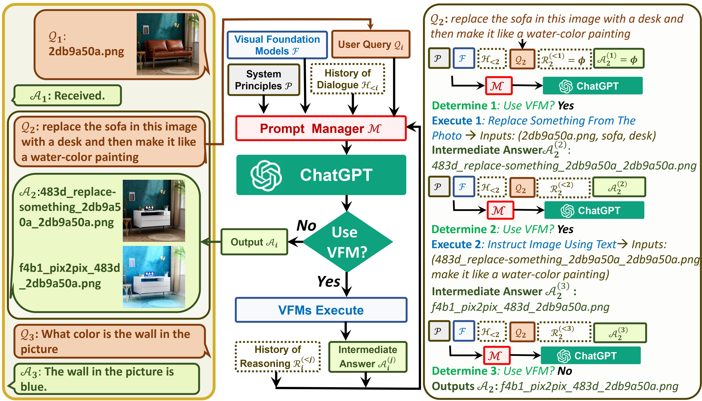

# visual-chatgpt-zh-vits

visual-chatgpt支持中文的windows版本

融合vits推断模块


官方论文: [<font size=5>Visual ChatGPT: Talking, Drawing and Editing with Visual Foundation Models</font>](https://arxiv.org/abs/2303.04671)

官方仓库：[visual-chatgpt](https://github.com/microsoft/visual-chatgpt)

fork from：[visual-chatgpt-zh](https://github.com/wxj630/visual-chatgpt-zh)


## Demo 


##  System Architecture 


<p align="center"></p>


## Quick Start

```
# 1、下载代码
git clone https://github.com/FrankZxShen/visual-chatgpt-zh-vits.git

# 2、进入项目目录
cd visual-chatgpt-zh-vits

# 3、创建python环境并激活环境
conda create -n visgpt python=3.8
activate visgpt 

# 4、安装环境依赖
pip install -r requirement.txt

# 5、确认api key
export OPENAI_API_KEY={Your_Private_Openai_Key}
# windows系统用set命令而不是export
set OPENAI_API_KEY={Your_Private_Openai_Key}

# 6、下载hf模型到指定目录
# 具体模型文件目录位于hf_models，可以根据需求下载不同模型
# 若需要vits推断功能将G.pth config.json放于vits_models下（目前仅支持日语？）
# Windows：下载pyopenjtalk Windows于text下

# 7、启动系统,这个例子我们加载了ImageCaptioning和Text2Image两个模型，
python visual_chatgpt_zh_vits.py
# 想要用哪个功能就可增加一些模型加载
python visual_chatgpt_zh_vits.py 
--load ImageCaptioning_cuda:0,Text2Image_cuda:0 \
--pretrained_model_dir {your_hf_models_path} \

# 8、可以直接在visual_chatgpt_zh_vits.py 38行修改key 若需要vits 39行设定True
```

原作者：根据官方建议，不同显卡可以指定不同“--load”参数，显存不够的就可以时间换空间，把不重要的模型加载到cpu上，虽然推理慢但是好歹能跑不是？（手动狗头）：

```
# Advice for CPU Users
python visual_chatgpt.py --load ImageCaptioning_cpu,Text2Image_cpu

# Advice for 1 Tesla T4 15GB  (Google Colab)                       
python visual_chatgpt.py --load "ImageCaptioning_cuda:0,Text2Image_cuda:0"
                                
# Advice for 4 Tesla V100 32GB                            
python visual_chatgpt.py --load "ImageCaptioning_cuda:0,ImageEditing_cuda:0,
    Text2Image_cuda:1,Image2Canny_cpu,CannyText2Image_cuda:1,
    Image2Depth_cpu,DepthText2Image_cuda:1,VisualQuestionAnswering_cuda:2,
    InstructPix2Pix_cuda:2,Image2Scribble_cpu,ScribbleText2Image_cuda:2,
    Image2Seg_cpu,SegText2Image_cuda:2,Image2Pose_cpu,PoseText2Image_cuda:2,
    Image2Hed_cpu,HedText2Image_cuda:3,Image2Normal_cpu,
    NormalText2Image_cuda:3,Image2Line_cpu,LineText2Image_cuda:3"
```

实测环境 Windows RTX3070 8G：若只需要ImageCaptioning和Text2Image两个模型的功能，对显存要求极低，理论上能跑AI绘图均可以（>4G，但速度很慢）？

## limitations

img无法显示在gradio上？

## Acknowledgement

We appreciate the open source of the following projects:

- HuggingFace [[Project]](https://github.com/huggingface/transformers)

- ControlNet  [[Paper]](https://arxiv.org/abs/2302.05543) [[Project]](https://github.com/lllyasviel/ControlNet)

- Stable Diffusion [[Paper]](https://arxiv.org/abs/2112.10752)  [[Project]](https://github.com/CompVis/stable-diffusion)
